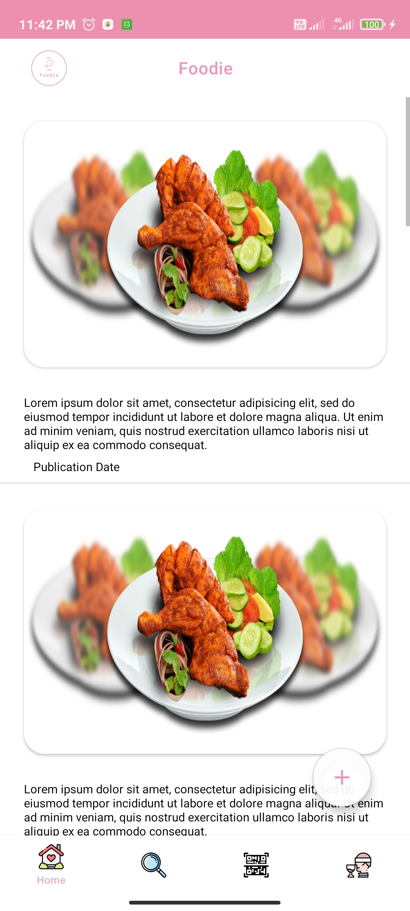
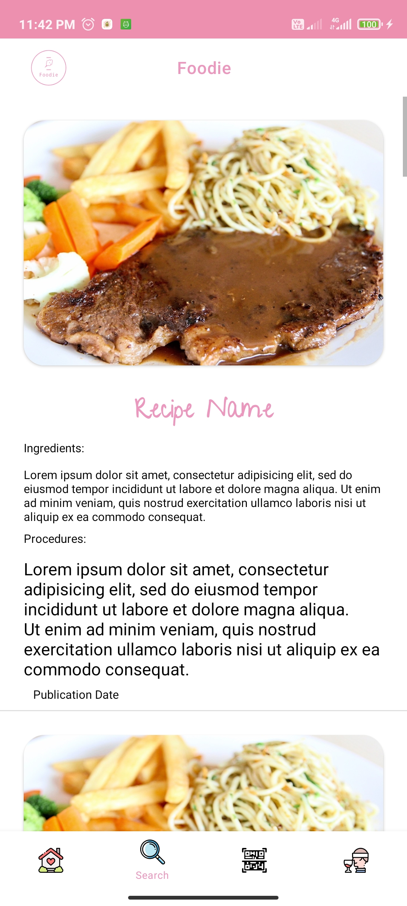
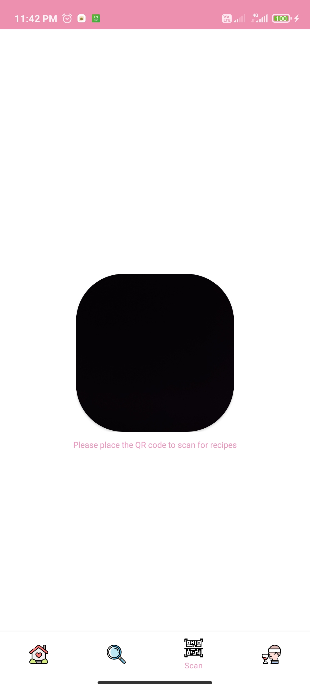
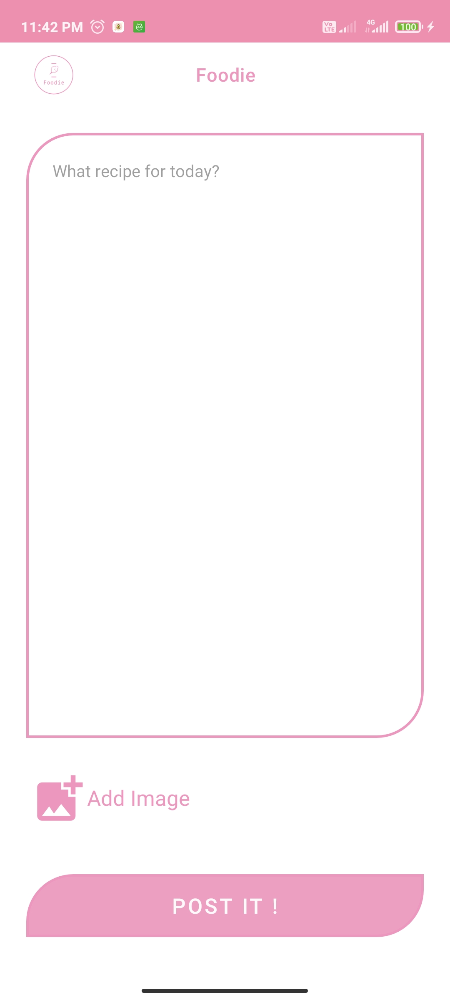

# FoodieMe
 "A Wondrous, Responsive and Simple Recipe App"

```
Comment From Developer : 

I spent 2 weeks on this project without actually do deep into ***kotlin*** 
I came from a Java Development background , So i just learn basic syntax of 
kotlin while understand the arch in Java.
```






